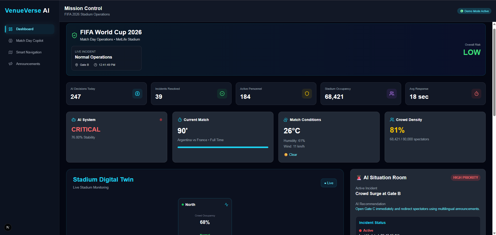
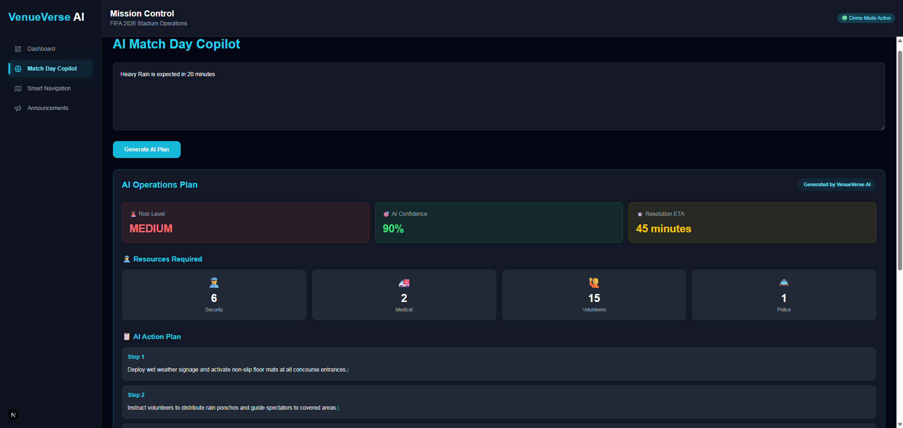
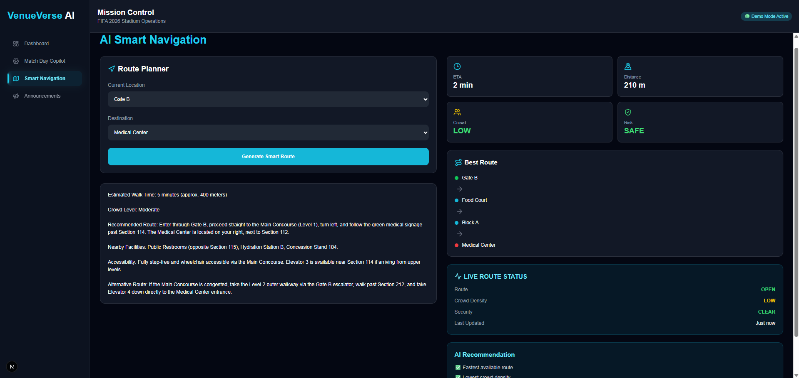
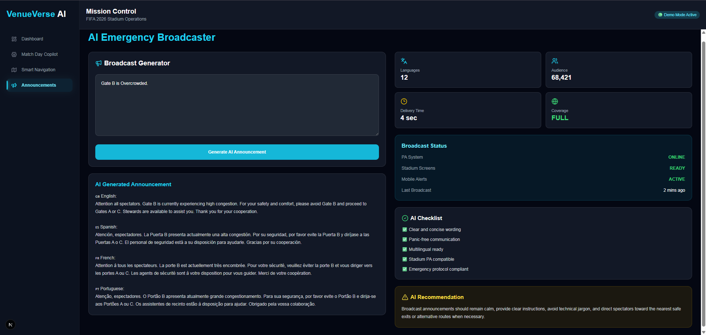
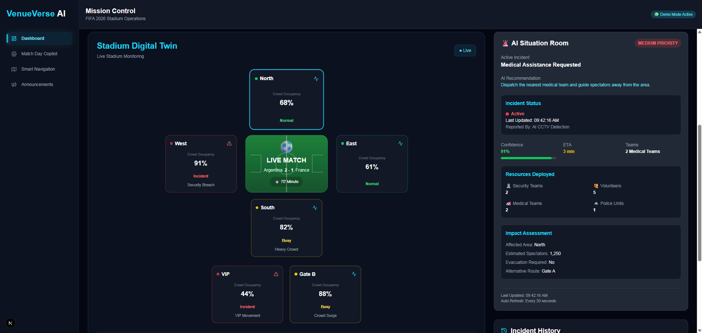

<div align="center">

# 🏟️ VenueVerse AI

### AI-Powered Stadium Operations Platform for FIFA World Cup 2026

Intelligent stadium monitoring, AI-assisted incident response, smart navigation, and emergency communication for modern sporting events.


</div>

---

### AI-Powered Stadium Operations Platform for FIFA World Cup 2026

VenueVerse AI is an intelligent stadium operations platform designed to help organizers monitor, manage, and respond to real-time events during large sporting events like the FIFA World Cup 2026.

The platform combines live stadium visualization with AI-powered decision support to improve operational efficiency, crowd safety, emergency response, and fan experience.

---

## ✨ Features

- 🤖 AI Stadium Operations Commander
- 🧭 Smart Indoor Navigation
- 📢 AI Emergency Broadcaster
- 🏟️ Interactive Stadium Digital Twin
- 📊 Live Stadium Monitoring Dashboard
- 🚨 Incident History & Activity Feed
- 🎯 Situation Room
- 🌦️ Weather Monitoring
- ⏱️ Live Match Information

---

## 🛠 Tech Stack

- Next.js 16
- React 19
- TypeScript
- Tailwind CSS
- Google Gemini API
- Framer Motion
- Lucide React

---

## 📸 Screenshots

### Dashboard



### AI Commander



### Smart Navigation



### Emergency Broadcaster



### Digital Twin



---

## 🚀 Getting Started

```bash
npm install

npm run dev
```

Open:

```
http://localhost:3000
```

---

## 🔑 Environment Variables

Create a `.env.local` file.

```env
GEMINI_API_KEY=YOUR_GEMINI_API_KEY
```

---

## 📂 Project Structure

```
app/
components/
context/
public/
lib/
```

---

## 🔮 Future Scope

- IoT Sensor Integration
- CCTV Video Analytics
- Predictive Crowd Congestion
- Multi-Stadium Management
- Drone Surveillance Integration
- Mobile Companion App

---

## 👨‍💻 Built For

AI-powered Stadium Operations Hackathon

---

## 📜 License

MIT License